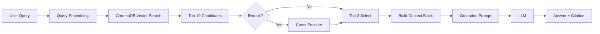

# Architecture — RAG Pipeline (Day 08 Lab)

> Template: Điền vào các mục này khi hoàn thành từng sprint.
> Deliverable của Documentation Owner.

## 1. Tổng quan kiến trúc

```
[Raw Docs]
    ↓
[index.py: Preprocess → Chunk → Embed → Store]
    ↓
[ChromaDB Vector Store]
    ↓
[rag_answer.py: Query → Retrieve → Rerank → Generate]
    ↓
[Grounded Answer + Citation]
```

**Mô tả ngắn gọn:**
Hệ thống RAG hỗ trợ tra cứu tài liệu nội bộ của công ty. Người dùng là nhân viên bộ phận IT, HR, và CS. Nó giúp tìm kiếm thông tin và có trích dẫn nguồn cụ thể.

---

## 2. Indexing Pipeline (Sprint 1)

### Tài liệu được index

| File                     | Nguồn                    | Department  | Số chunk |
| ------------------------ | ------------------------ | ----------- | -------- |
| `policy_refund_v4.txt`   | policy/refund-v4.pdf     | CS          | 6        |
| `sla_p1_2026.txt`        | support/sla-p1-2026.pdf  | IT          | 5        |
| `access_control_sop.txt` | it/access-control-sop.md | IT Security | 7        |
| `it_helpdesk_faq.txt`    | support/helpdesk-faq.md  | IT          | 6        |
| `hr_leave_policy.txt`    | hr/leave-policy-2026.pdf | HR          | 5        |

### Quyết định chunking

| Tham số           | Giá trị                                             | Lý do                                                                               |
| ----------------- | --------------------------------------------------- | ----------------------------------------------------------------------------------- |
| Chunk size        | 400 tokens                                          | Cân bằng giữa việc giữ đủ ngữ cảnh và độ chính xác khi retrieval.                   |
| Overlap           | 80 tokens                                           | Tránh mất thông tin quan trọng nằm ở ranh giới giữa các chunk.                      |
| Chunking strategy | Heading-based / paragraph-based                     | Ưu tiên giữ cấu trúc logic của tài liệu (section) và cắt nhỏ theo đoạn văn nếu cần. |
| Metadata fields   | source, section, effective_date, department, access | Phục vụ filter, freshness, citation                                                 |

### Embedding model

- **Model**: `paraphrase-multilingual-MiniLM-L12-v2` (Sentence Transformers)
- **Vector store**: ChromaDB (PersistentClient)
- **Similarity metric**: Cosine

---

## 3. Retrieval Pipeline (Sprint 2 + 3)

### Baseline (Sprint 2)

| Tham số      | Giá trị                      |
| ------------ | ---------------------------- |
| Strategy     | Dense (embedding similarity) |
| Top-k search | 10                           |
| Top-k select | 3                            |
| Rerank       | Không                        |

### Variant (Sprint 3)

| Tham số         | Giá trị               | Thay đổi so với baseline                                        |
| --------------- | --------------------- | --------------------------------------------------------------- |
| Strategy        | Hybrid (Dense + BM25) | Thêm từ khóa (keyword) để hỗ trợ tìm mã lỗi/tên tài liệu        |
| Top-k search    | 15                    | Mở rộng phạm vi truy xuất để không bỏ những đối tượng tiềm năng |
| Top-k select    | 4                     | Mở rộng phạm vi truy xuất để không bỏ những đối tượng tiềm năng |
| Rerank          | cross-encoder         | Weighted fusion (Dense: 0.6, Sparse: 0.4)                       |
| Query transform | Không                 | Giữ nguyên                                                      |

**Lý do chọn variant này:**
Chọn **hybrid** vì tài liệu nội bộ chứa nhiều mã lỗi chuyên ngành (ERR-403, Jira project ID,...) và các thuật ngữ viết tắt (SLA P1, HR-2026). Việc kết hợp sử dụng sparse giúp bắt chính xác các mã này.

---

## 4. Generation (Sprint 2)

### Grounded Prompt Template

```
--- Sprint 2: Test Baseline (Dense) ---

Query: SLA xử lý ticket P1 là bao lâu?

[RAG] Query: SLA xử lý ticket P1 là bao lâu?
[RAG] Retrieved 10 candidates (mode=dense)
[1] score=0.644 | support/sla-p1-2026.pdf
[2] score=0.533 | support/sla-p1-2026.pdf
[3] score=0.491 | it/access-control-sop.md
[RAG] After select: 3 chunks

[RAG] Prompt:
Answer only from the retrieved context below.
If the context is insufficient to answer the question, say you do not know and do not make up information.
Cite the source field (in brackets like [1]) when possible.
Keep your answer short, clear, and factual.
Respond in the same language as the question.

Question: SLA xử lý ticket P1 là bao lâu?

Context:
[1] support/sla-p1-2026.pdf | Phần 2: SLA theo mức độ ưu tiên | score=0.64
Ticket P1:

- Phản hồi ban đầu (first response): 15 phút kể từ khi tic...

Answer: SLA xử lý ticket P1 là 4 giờ [1].
Sources: ['support/sla-p1-2026.pdf', 'it/access-control-sop.md']

Query: Khách hàng có thể yêu cầu hoàn tiền trong bao nhiêu ngày?

[RAG] Query: Khách hàng có thể yêu cầu hoàn tiền trong bao nhiêu ngày?
[RAG] Retrieved 10 candidates (mode=dense)
[1] score=0.676 | policy/refund-v4.pdf
[2] score=0.618 | policy/refund-v4.pdf
[3] score=0.602 | hr/leave-policy-2026.pdf
[RAG] After select: 3 chunks

[RAG] Prompt:
Answer only from the retrieved context below.
If the context is insufficient to answer the question, say you do not know and do not make up information.
Cite the source field (in brackets like [1]) when possible.
Keep your answer short, clear, and factual.
Respond in the same language as the question.

Question: Khách hàng có thể yêu cầu hoàn tiền trong bao nhiêu ngày?

Context:
[1] policy/refund-v4.pdf | Điều 2: Điều kiện được hoàn tiền | score=0.68
Khách hàng được quyền yêu cầu hoàn tiền khi đ...

Answer: Khách hàng có thể yêu cầu hoàn tiền trong vòng 7 ngày làm việc kể từ thời điểm xác nhận đơn hàng [1].
Sources: ['policy/refund-v4.pdf', 'hr/leave-policy-2026.pdf']

Query: Ai phải phê duyệt để cấp quyền Level 3?

[RAG] Query: Ai phải phê duyệt để cấp quyền Level 3?
[RAG] Retrieved 10 candidates (mode=dense)
[1] score=0.472 | it/access-control-sop.md
[2] score=0.465 | it/access-control-sop.md
[3] score=0.404 | it/access-control-sop.md
[RAG] After select: 3 chunks

[RAG] Prompt:
Answer only from the retrieved context below.
If the context is insufficient to answer the question, say you do not know and do not make up information.
Cite the source field (in brackets like [1]) when possible.
Keep your answer short, clear, and factual.
Respond in the same language as the question.

Question: Ai phải phê duyệt để cấp quyền Level 3?

Context:
[1] it/access-control-sop.md | Section 5: Thu hồi quyền truy cập | score=0.47
Quyền phải được thu hồi trong các trường hợp:

- Nhân viên ...

Answer: Line Manager + IT Admin + IT Security phải phê duyệt để cấp quyền Level 3 [2].
Sources: ['it/access-control-sop.md']

Query: ERR-403-AUTH là lỗi gì?

[RAG] Query: ERR-403-AUTH là lỗi gì?
[RAG] Retrieved 10 candidates (mode=dense)
[1] score=0.351 | it/access-control-sop.md
[2] score=0.275 | support/sla-p1-2026.pdf
[3] score=0.247 | support/helpdesk-faq.md
[RAG] After select: 3 chunks

[RAG] Prompt:
Answer only from the retrieved context below.
If the context is insufficient to answer the question, say you do not know and do not make up information.
Cite the source field (in brackets like [1]) when possible.
Keep your answer short, clear, and factual.
Respond in the same language as the question.

Question: ERR-403-AUTH là lỗi gì?

Context:
[1] it/access-control-sop.md | Section 7: Công cụ liên quan | score=0.35
Ticket system: Jira (project IT-ACCESS)
IAM system: Okta
Audit log: Splunk
Emai...

Answer: Tôi không biết ERR-403-AUTH là lỗi gì dựa trên ngữ cảnh được cung cấp.
Sources: ['it/access-control-sop.md', 'support/sla-p1-2026.pdf', 'support/helpdesk-faq.md']
```

### LLM Configuration

| Tham số     | Giá trị                        |
| ----------- | ------------------------------ |
| Model       | `gemini-2.5-flash`             |
| Temperature | 0 (để output ổn định cho eval) |
| Max tokens  | 512                            |

---

## 5. Failure Mode Checklist

> Dùng khi debug — kiểm tra lần lượt: index → retrieval → generation

| Failure Mode   | Triệu chứng                          | Cách kiểm tra                                |
| -------------- | ------------------------------------ | -------------------------------------------- |
| Index lỗi      | Retrieve về docs cũ / sai version    | `inspect_metadata_coverage()` trong index.py |
| Chunking tệ    | Chunk cắt giữa điều khoản            | `list_chunks()` và đọc text preview          |
| Retrieval lỗi  | Không tìm được expected source       | `score_context_recall()` trong eval.py       |
| Generation lỗi | Answer không grounded / bịa          | `score_faithfulness()` trong eval.py         |
| Token overload | Context quá dài → lost in the middle | Kiểm tra độ dài context_block                |

---

## 6. Diagram (tùy chọn)

> TODO: Vẽ sơ đồ pipeline nếu có thời gian. Có thể dùng Mermaid hoặc drawio.


